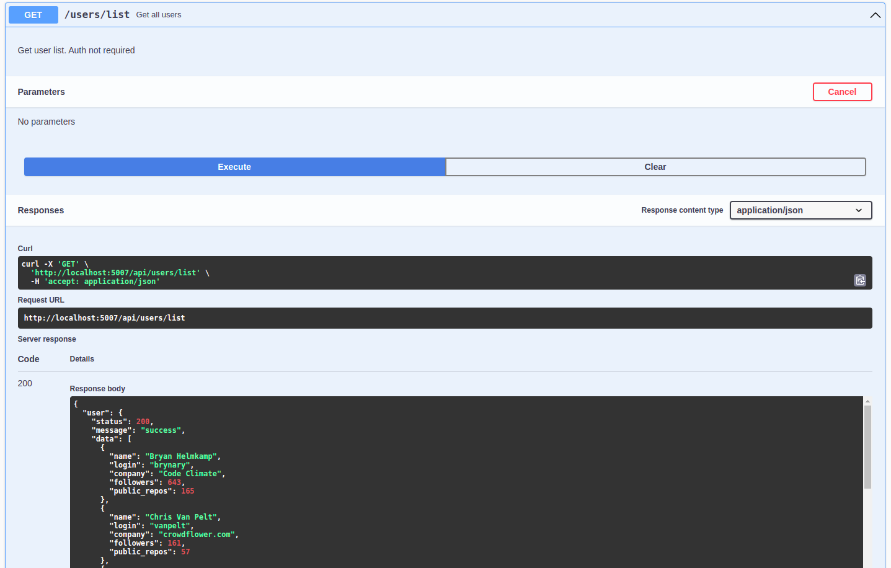
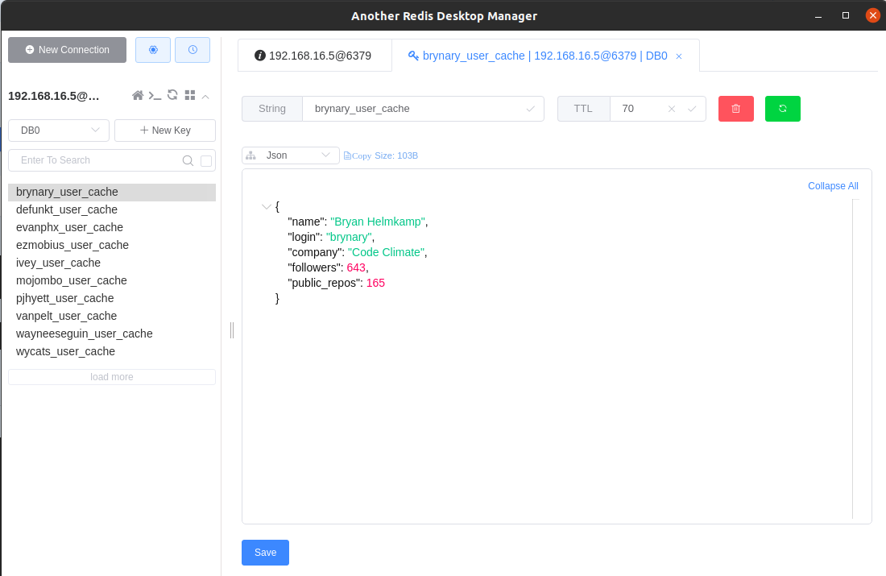

# 
# users-api
Simple Github User API Ready Prod.

## Quick start

Quick start you must install [docker](https://www.docker.com), [docker-compose](https://docs.docker.com/compose/), [Git](https://git-scm.com/) and [Fiber-Swagger](https://github.com/arsmn/fiber-swagger).

**Create new docker network**
```bash
➜ sudo make network-prune
➜ sudo make network
```

**Builds and tests**

```bash
git clone https://github.com/edlorenzo/users-api.git
cd users-api
chmod o+w ./tests/postman
sudo chmod a+x start.sh
sudo ./start.sh
```
Press <code>Ctrl + c</code> to stop application.

## Getting started

### Install Golang (go1.17+)

Please check the official golang installation guide before you start. [Official Documentation](https://golang.org/doc/install)
Also make sure you have installed go1.17+ version.

For more info and detailed instructions please check this guide: [Setting GOPATH](https://github.com/golang/go/wiki/SettingGOPATH)

### Initialize Swagger Docs
```bash
go install github.com/swaggo/swag/cmd/swag@latest
make swagger-init
```

### Working with makefile

```bash
make help
```

### Install dependencies

```bash
➜ go mod download
➜ make tidy
```

### Run

```bash
➜ go run main.go
```

### Build

```bash
➜ go build
```

### Tests

```bash
➜ make test
```
### Swagger UI
Access the application using the port `5007`.
Open url http://localhost:5007/swagger/index.html in browser.
# 

### Another Redis Desktop Manager
Visualizing data stored from Redis using Another Redis Desktop Manager.
# 

### List of technology used:
* [Golang](https://go.dev/) - Go Programming Language.
* [Fiber](https://github.com/gofiber/fiber) - Go Web Framework.
* [Redis](https://github.com/go-redis/redis) - A Redis Client for Go.
* [Fiber-Swagger](https://github.com/arsmn/fiber-swagger) - Swagger for Fiber framework.
* [docker](https://www.docker.com) - Docker
* [docker-compose](https://docs.docker.com/compose/) - Docker Compose
* [Git](https://git-scm.com/) - Git
* [newman-docker](https://hub.docker.com/r/postman/newman_alpine33/) - API automation test.

### Solutions and Integration Section
* Response data is sorted by name in ascending order. 
```bash
	sort.Slice(r.User.Data[:], func(i, j int) bool {
		return r.User.Data[i].Name < r.User.Data[j].Name
	})
```
* Iteration can be resumed if some usernames cannot be found.
* Caching feature to store user data in 2 minutes. If user's information has been cached, it should NOT hit Github again to retrieve the same user, instead it should return the user from the cache.
* Logrus integration for good error handling and logs.
* Added Http network feature to validate incoming http request.
* Only used pure http to call Github user api.
* Integration of swagger api documentation.
* Redis data store and data fetch, using serialize and deserialization approach to meet proper storing of data as redis only allowed flat data storing.
